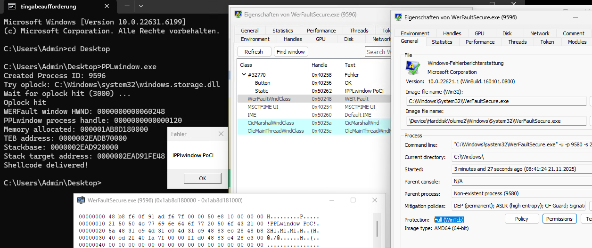

# PPLwindow

PPLwindow is a Proof-of-Concept for a PPL Bypass that affects Windows 10 1809 to Windows 11 23H2. The NtUserGetWindowProcessHandle syscall from win32kfull.sys driver doesn't properly check if a process is a protected process on the mentioned Windows versions. This can be abused to get a process handle with PROCESS_QUERY_LIMITED_INFORMATION | PROCESS_VM_OPERATION | PROCESS_VM_READ | PROCESS_VM_WRITE | PROCESS_DUP_HANDLE to a protected process from an unprotected process.

The target protected process needs a window for this bypass to work. The PoC exploits WerFaultSecure.exe and achieves PP-WinTcb. For this bypass no admin privileges are required. It was fixed in Windows 11 24H2.

I saw this post from James Forshaw: https://infosec.exchange/@tiraniddo/115539156769921108

My first reaction was: Wait a seconds. I know this. I already found this in 2023 together with CVE-2023-41772, but couldn't find a protected process as a valid target. So thanks to James Forshaw for finding a good target (WerFaultSecure.exe). I told Microsoft about this, when I reported CVE-2023-41772. This might be the reason why this was fixed in Windows 11 24H2.

